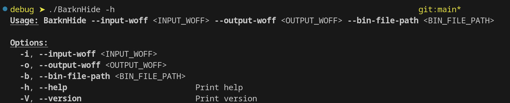

# BarknHide

## Hide binary data in Woff2 files!

This code will take in two files, an unaltered Woff2 file and a bin file. It will add the bin file to the end of Woff2 input file, update the Woff2 Headers:

- UInt32 length
- UInt32 privOffset
- UInt32 privLength

If you ever need to recover the bin data, just start reading from the privOffset [36, 37, 38, 39] header to the end of the file.

## Usage

`BarknHide --input-woff <INPUT_WOFF> --output-woff <OUTPUT_WOFF> --bin-file-path <BIN_FILE_PATH>`

